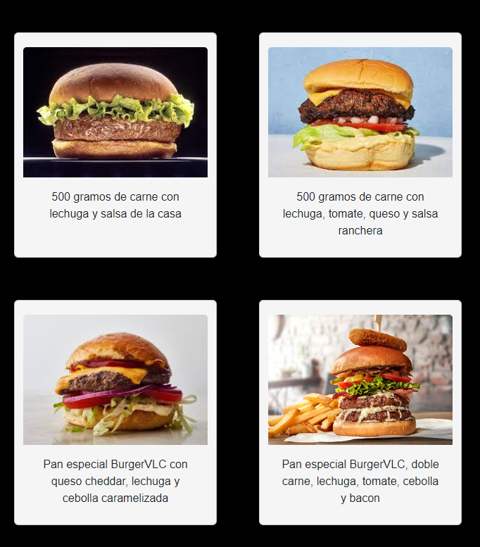

<h1 align="center">BurgerVLC
</h1>
​
​
__<h2 align="center">Proyecto 1 - Carta Restaurante </h2>
​

Este proyecto fue realizado por Pablo Ezequiel Prost, alumno del Bootcamp Full Stack Developer de Valencia, en Septiembre de 2023.

_______________________________________________________________

​
​
<h1 align="center"> Presentación del proyecto: </h1>
​

☆ El proyecto de "BurgerVLC" es una página web escrita en el lenguaje HTML, donde podemos ir navegando por las diferentes categorías siguientes:

<h2 style="color: blue"> ✦ INDEX: </h2>

↠ En el INDEX nos muestra una breve información acerca del restaurante y al final del mismo encontramos dos botones para navegar entre las páginas de MENÚ y CONTACTO. También se añade una imagen de muestra sobre la comida que se puede conseguir en el restaurante.

<h2 style="color: blue"> ✦ MENU: </h2>

↠ En el MENU encontramos la variedad de platos que el restaurante ofrece a sus clientes pudiendo navegar entre varias opciones y platos especiales, contando también con un menú vegano.

<h2 style="color: blue"> ✦ CONTACTO: </h2>

↠ En la página de contacto podremos contactar al restaurante por medio de un formulario en el cual nos deja elegir entre una serie de opciones como: reserva, celebra tu cumpleaños aquí y consulta.

​
<h1 align="center" style="color: green">VENTAJAS
</h1>

▸Una de las grandes ventajas de este sitio web es su simplicidad, permitiendo a cualquier usuario poder navegar en el y acceder a sus diferentes secciones.

▸Otra gran ventaja es que el sitio es un sitio web responsive, por lo que los usuarios tambien podrán acceder a el desde sus teléfonos móviles y navegar sin problemas.

​

<h1 align="center" style="color: red">DESVENTAJAS
</h1>

▸Los botones en la parte inferior del INDEX son muy pequeños vistos en la pantalla de un ordenador, y al entrar desde el móvil los botones se vuelven exageradamente grande. Asi también su diseño es demasiado simple y no va acorde al estilo de la página.

▸En la sección del MENU, los platos no tienen nombre que los caracterice, ni tampoco muestran el costo de los mismos, por lo que puede haber problemas a la hora de preguntar acerca de un plato y también los clientes pueden no concurrir al restaurante ya que no tienen conocimiento del costo de la comida.

​

<h2 style="color: orange"> ✱ TECNOLOGÍAS UTILIZADAS: </h2>

➳ BOOTSTRAP

➳ HTML

➳ CSS

​
<h1 align="center" style="color: red">BUGS
</h1>

▻ Al movernos a la página de MENU o CONTACTO y entrar en modo responsive, el menú hamburguesa situado en la parte superior no funciona y no se despliega.

​

Estos bugs se intentaron solucionar pero no se logró.
​

​